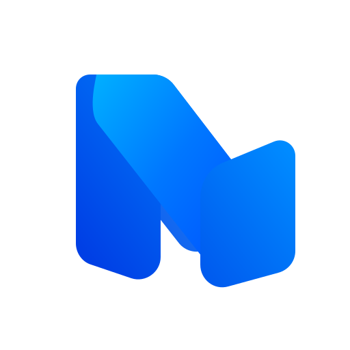
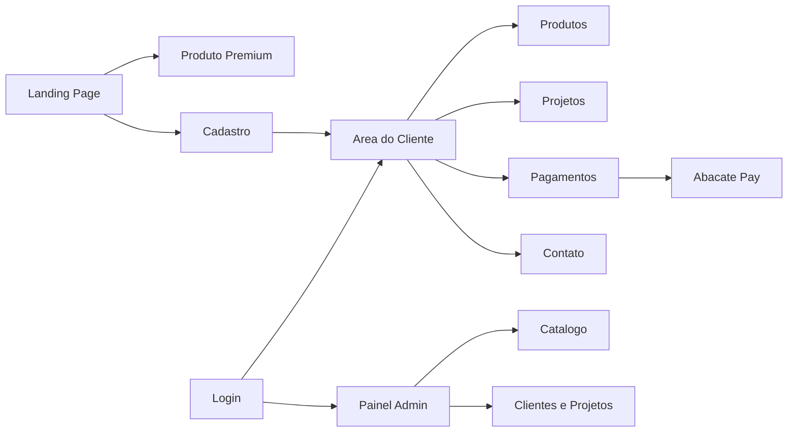

<div align="center">
  

  <h1>NovaCore AI</h1>

  <p>
    <strong>Site, painel e experiencia premium para vender e operar automacoes inteligentes com IA.</strong>
  </p>

  <p>
    
    
    
    
  </p>
</div>

---

## Visao Geral

A NovaCore AI combina uma landing page comercial, uma tela premium de produto, area do cliente, painel administrativo,
cadastro/login, notificacoes, mensagens, catalogo de produtos e integracao de checkout via Abacate Pay.

O site foi desenhado para comunicar uma plataforma de IA operacional de alto valor, com foco em:

| Frente | O que resolve |
| --- | --- |
| Atendimento | Agentes e automacoes para responder, qualificar e encaminhar clientes. |
| Vendas | Follow-ups, organizacao de leads e oportunidades reais de conversao. |
| CRM | Atualizacao automatica de dados, pipeline e historico de interacoes. |
| Suporte | Triagem, respostas consistentes e acompanhamento de demandas. |
| Agendamentos | Confirmacoes, lembretes e sincronizacao de horarios. |
| Processos | Fluxos internos sob medida para reduzir trabalho manual. |

## Sumario

- [Stack](#stack)
- [Mapa do Produto](#mapa-do-produto)
- [Rotas](#rotas)
- [APIs](#apis)
- [Como Rodar](#como-rodar)
- [Variaveis de Ambiente](#variaveis-de-ambiente)
- [Scripts](#scripts)
- [Banco de Dados](#banco-de-dados)
- [Estrutura](#estrutura)
- [Deploy](#deploy)
- [Manutencao do README](#manutencao-do-readme)

## Stack

| Camada | Tecnologias |
| --- | --- |
| App | Next.js 16, React 19, App Router |
| Linguagem | TypeScript |
| UI | Tailwind CSS 4, shadcn, Lucide React |
| Motion | Framer Motion, tw-animate-css |
| Dados | Prisma 6, SQLite |
| Runtime/Deploy | Netlify, Netlify Blobs |
| Analytics | Vercel Analytics em producao |
| Pagamentos | Abacate Pay |

## Mapa do Produto



## Rotas

| Rota | Descricao |
| --- | --- |
| `/` | Landing page com hero, servicos, beneficios, sobre, cadastro e footer. |
| `/produto` | Tela premium para vender automacoes inteligentes da NovaCore AI. |
| `/login` | Login de clientes e administradores. |
| `/login/recuperar-senha` | Recuperacao de senha. |
| `/cliente/cadastrar` | Cadastro de novo cliente. |
| `/cliente` | Area do cliente com perfil, produtos, projetos, pagamentos e contato. |
| `/admin` | Painel administrativo para clientes, projetos, produtos e operacao. |

## APIs

| Endpoint | Funcao |
| --- | --- |
| `/api/register` | Cadastro de usuarios. |
| `/api/login` | Autenticacao. |
| `/api/client/profile` | Perfil do cliente. |
| `/api/admin/clients` | Clientes para administracao. |
| `/api/projects` | Projetos. |
| `/api/products` | Catalogo de produtos. |
| `/api/messages` | Mensagens entre cliente e equipe. |
| `/api/notifications` | Notificacoes. |
| `/api/password-reset/request` | Solicita codigo de redefinicao. |
| `/api/password-reset/verify` | Valida codigo de redefinicao. |
| `/api/password-reset/reset` | Troca a senha. |
| `/api/payments/abacate/checkout` | Cria checkout Abacate Pay. |
| `/api/webhooks/abacate-pay` | Recebe webhooks Abacate Pay. |

## Como Rodar

Requisitos:

| Ferramenta | Versao |
| --- | --- |
| Node.js | 20.x |
| npm | Versao instalada com Node 20 |

Instale as dependencias:

```bash
npm install
```

Configure o banco e gere o Prisma Client:

```bash
npm run db:generate
npm run db:init
```

Suba o ambiente de desenvolvimento:

```bash
npm run dev
```

Acesse:

```text
http://localhost:3000
```

## Variaveis de Ambiente

O projeto usa SQLite por padrao. Se `DATABASE_URL` nao estiver definida, o app usa:

```text
file:../data/novacore.db
```

| Variavel | Uso |
| --- | --- |
| `DATABASE_URL` | Caminho/conexao do banco SQLite usado pelo Prisma. |
| `NEXT_PUBLIC_SITE_URL` | URL publica usada em callbacks e checkout. |
| `ABACATEPAY_API_KEY` | Chave da API Abacate Pay. |
| `ABACATEPAY_API_URL` | URL base opcional da API Abacate Pay. |
| `ABACATEPAY_WEBHOOK_SECRET` | Segredo para validar webhooks Abacate Pay. |
| `NETLIFY` | Indica runtime Netlify. |
| `NETLIFY_BLOBS_CONTEXT` | Habilita stores baseadas em Netlify Blobs. |

Exemplo local:

```env
DATABASE_URL="file:../data/novacore.db"
NEXT_PUBLIC_SITE_URL="http://localhost:3000"
ABACATEPAY_API_KEY=""
ABACATEPAY_API_URL=""
ABACATEPAY_WEBHOOK_SECRET=""
```

> Nao commite arquivos `.env` com chaves reais.

## Scripts

| Comando | Descricao |
| --- | --- |
| `npm run dev` | Inicia o Next em desenvolvimento. |
| `npm run build` | Gera build de producao. |
| `npm run start` | Inicia o build de producao. |
| `npm run db:generate` | Gera Prisma Client. |
| `npm run db:init` | Aplica migracoes SQL locais. |
| `npm run db:studio` | Abre Prisma Studio. |
| `npm run lint` | Roda ESLint, se o binario estiver instalado/configurado. |

## Banco de Dados

Schema Prisma:

```text
prisma/schema.prisma
```

Migracoes SQL:

```text
prisma/migrations
```

| Modelo | Responsabilidade |
| --- | --- |
| `User` | Clientes e administradores. |
| `Product` | Produtos cadastrados para compra. |
| `Project` | Projetos e status de pagamento. |
| `Invoice` | Cobrancas. |
| `Message` | Mensagens cliente/equipe. |
| `Notification` | Notificacoes. |
| `PasswordResetRequest` | Recuperacao de senha. |

## Estrutura

```text
app/                 rotas, paginas e APIs do Next
components/          componentes compartilhados da interface
lib/                 regras de negocio, stores, auth e integracoes
prisma/              schema e migracoes
public/              imagens, icones e assets estaticos
scripts/             scripts utilitarios
```

## Produto Visual

A pagina `/produto` comunica uma plataforma de IA premium com:

| Elemento | Direcao visual |
| --- | --- |
| Hero | Cinematografico, dark mode, badge e CTAs com glow. |
| Mockup | Dashboard SaaS vivo com CRM, automacoes, analytics e pipeline. |
| Fundo | Grid futurista, glow azul/roxo, particulas, linhas holograficas e noise. |
| Movimento | Entradas suaves, parallax, floating UI, hover glow e breathing effects. |
| Secoes | Demonstracao, timeline, beneficios, CTA final e footer premium. |

## Deploy

Configuracao:

```text
netlify.toml
```

| Item | Valor |
| --- | --- |
| Build command | `npm run build` |
| Publish directory | `.next` |
| Node | `20` |
| DATABASE_URL no Netlify | `file:/tmp/novacore.db` |

## Manutencao do README

Atualize este README sempre que uma mudanca alterar:

- rotas publicas ou APIs
- fluxo de instalacao, build ou deploy
- variaveis de ambiente
- estrutura de pastas
- stack, dependencias importantes ou banco de dados
- funcionamento das telas principais
- integracoes externas, como Abacate Pay ou Netlify

Mudancas apenas visuais pequenas podem nao exigir atualizacao, mas qualquer alteracao que afete como entender, rodar,
manter ou publicar o site deve ser documentada aqui.
